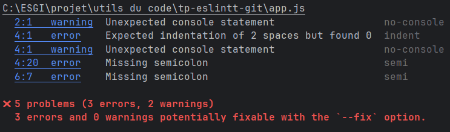

### 2
# 2

On observe qu'il y a 5 problemes (3 erreurs et 2 warnings) 
Je vais donc utilisé la commande npx eslint --fix app.js

# 3
Apres le remplacement des console.log en print, on observe que les erreurs on disparues.

### 3
# 1
